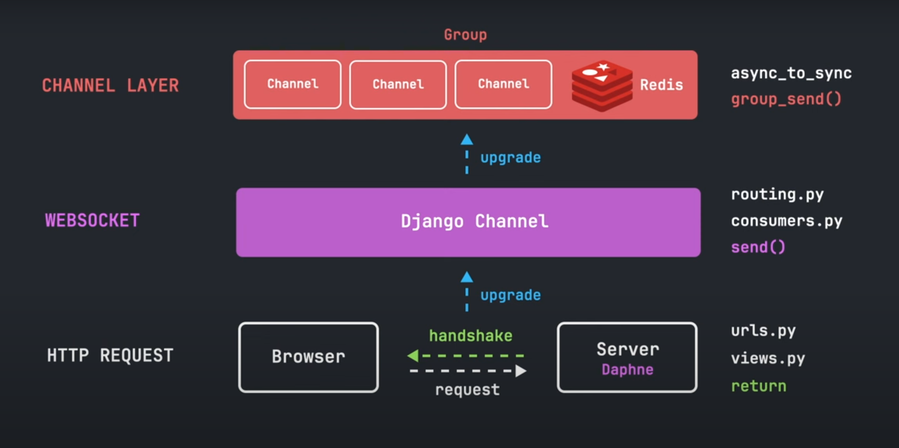

# What is WebSockets?
WebSockets is a communication protocol that provides a consistent connection between a client and a server.

# HTTP synchronous vs WebSocket asynchronous
## HTTP synchronous
  

  ## WebSocket asynchronous
     

## Understanding Implementation


### HTTP REQUEST.
- Browser send request to Server and Server send back handshake message
- In this phase we will use urls.py, views.py and return statement to return response.
### Upgradation to Webscokets
- Now, We will upgrade http request to django channel.
- In this phase, we will use routing.py, consumers.py and send() function.
### Upgradation to Channel Layer
- Now, We will upgrade Webscokets to Channel layer.
- This feature is useful when we have to send message in groups.
- In this phase, we will use async_to_sync,group_send() function.

# Let's Start!
## Create Virtul Environment
### Create
```bash
python -m venv env
```
### Activate
#### Linux or Mac
```bash
source env/bin/activate
```
#### Windows
```bash
env\Scripts\activate
```